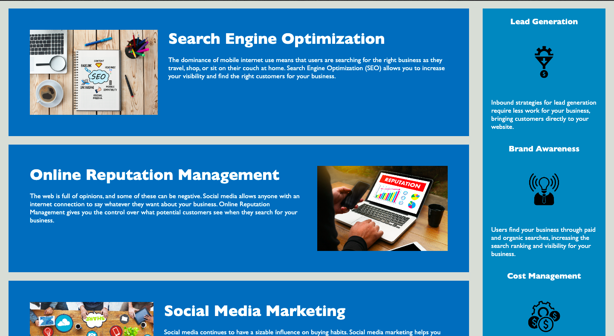
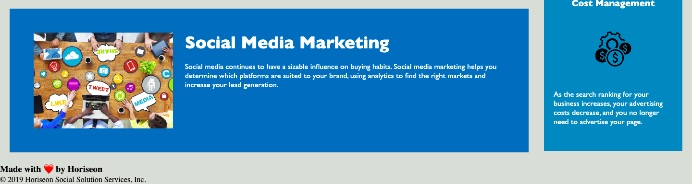

# horiseon

## Description: 
        Refactoring the Marketing Agency's site code to increase accessibility more users and increase site optimization for search engines using semantic structuring, accessible alt img labels, sequential ordering, etc.
        
##Usage:

##Credits:

Collaborators:
David Gallegos: Github.com/woahdavid
Boyd Roberts: GitHub.com/coleyrockin
Kaylla Hite 
